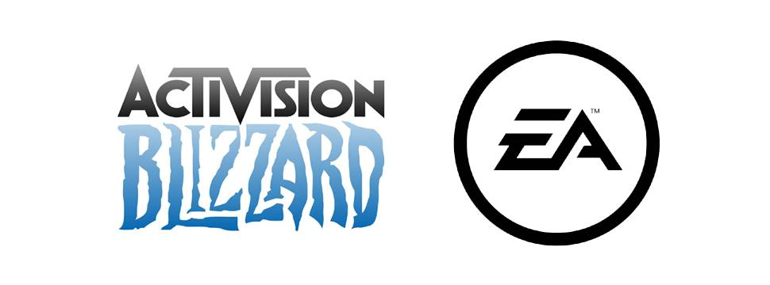

# 🎮💰 Análisis Financiero Comparativo: AB vs EA 💡📊

El proyecto se centra en un análisis integral financiero y estratégico de dos gigantes de la industria de los videojuegos: Blizzard Entertainment y Electronic Arts. 
Para llevar a cabo esta evaluación, se utilizó un Public Information Book (PIB) como herramienta principal, recopilando información clave de ambas compañías. Entre los datos analizados se incluyen reportes anuales, estados contables, indicadores de mercado, tendencias de precios de acciones y análisis realizados por expertos del sector.

  

El objetivo principal del análisis fue proporcionar una base sólida de datos financieros y estratégicos que permitieran evaluar la situación actual de ambas empresas. Para ello, se consideraron métricas esenciales como la solvencia, la rentabilidad, la inversión y el riesgo. Este enfoque no solo buscó determinar el desempeño financiero de las empresas, sino también comprender su posición dentro de un mercado tan competitivo como el de los videojuegos.

Metodología

El análisis combinó perspectivas financieras y estratégicas, abordando las estructuras contables comparables de las empresas y evaluando tendencias históricas dentro del contexto de la industria. Los supuestos clave del estudio incluyeron la precisión de los datos utilizados, la estabilidad de las condiciones macroeconómicas y la representatividad de las tendencias históricas para hacer proyecciones futuras. Este proceso no solo permitió desarrollar habilidades analíticas avanzadas, sino que también ofreció una comprensión profunda de los factores que influyen en las decisiones estratégicas del sector.

Resultados y Conclusiones

🏆 Activision Blizzard

La empresa se destacó por sus sólidos ingresos y márgenes operativos, gracias a un modelo de negocio centrado en ingresos recurrentes generados por expansiones, suscripciones y microtransacciones. Además, su ROIC (Retorno sobre el Capital Invertido) sobresalió, reflejando una gestión eficiente de sus recursos y un enfoque estratégico bien definido.

🕹️ Electronic Arts

Aunque Electronic Arts mostró un buen desempeño, se identificaron áreas de mejora, especialmente en la optimización de su margen operativo y el uso más eficiente del capital. Estas debilidades sugieren que la compañía enfrenta desafíos importantes para igualar el desempeño financiero de su rival, aunque sigue siendo un jugador relevante en el mercado.

En general, ambas empresas presentan fortalezas significativas que las posicionan como líderes del sector, pero con enfoques estratégicos diferentes.

Recomendaciones para Inversionistas

Se sugiere diversificar portafolios invirtiendo en ambas compañías. Aunque compiten en el mismo sector, sus modelos de negocio y carteras de productos ofrecen diferentes beneficios y riesgos, lo que ayuda a equilibrar las inversiones.

Es importante monitorear los cambios regulatorios relacionados con la posible fusión de Activision Blizzard con Microsoft, ya que podrían tener un impacto significativo en el mercado. Además, se recomienda seguir de cerca la expansión de ambas empresas en servicios digitales y microtransacciones, áreas que generan ingresos recurrentes con un gran potencial de crecimiento.

Por último, se destaca la importancia de observar las estrategias de expansión en mercados internacionales, especialmente en Asia. Aunque ambos gigantes han demostrado capacidad para aprovechar oportunidades en esta región, la competencia es intensa, y las regulaciones locales podrían representar desafíos adicionales.

Este análisis no solo ofrece una visión clara del desempeño de Activision Blizzard y Electronic Arts, sino que también proporciona recomendaciones prácticas para tomar decisiones de inversión informadas en un mercado dinámico y competitivo. 📈💡
